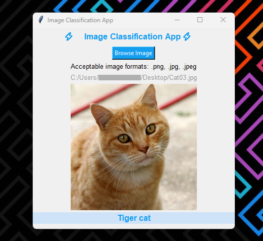

# Image Classification App

This is a simple image classification app made with using [MobileNetV2](https://www.tensorflow.org/api_docs/python/tf/keras/applications/mobilenet_v2/MobileNetV2) model and [Tensorflow](https://www.tensorflow.org/).

> 📌 This project is a part of a [medium.com](https://medium.com/@hammad.ai/how-to-use-a-trained-model-in-an-application-using-tensorflow-cd8b4024bb28) blog article that I have written. Be sure to check that out right [here](https://medium.com/@hammad.ai/how-to-use-a-trained-model-in-an-application-using-tensorflow-cd8b4024bb28).

## Installation

- Install the dependencies

```shell
pip3 install tensorflow Pillow
```

- or alternatively you can use the `requirements.txt` file to install all the dependencies

```shell
pip3 install -r requirements.txt
```

- then run the `export_model.py` script to create a directory with model binaries.

```shell
python3 ./export_model.py 
```

## Usage

To run the application you will first need to export the model into its directory(follow steps in [Installation](##-Installation))

The app will be available by running the `app.py` script.

```
python3 ./app.py
```

## Preview
